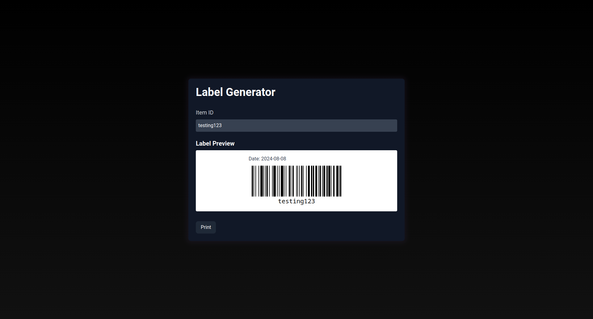

# Quick n' Easy Label Generator

This is a small Astro application to generate printable barcode labels.

## Setup

1. Clone the repository
2. Install the dependencies with `npm install`
3. Run the application with `npm run dev`
4. Navigate to the local server in your browser (usually `localhost:4321`)
